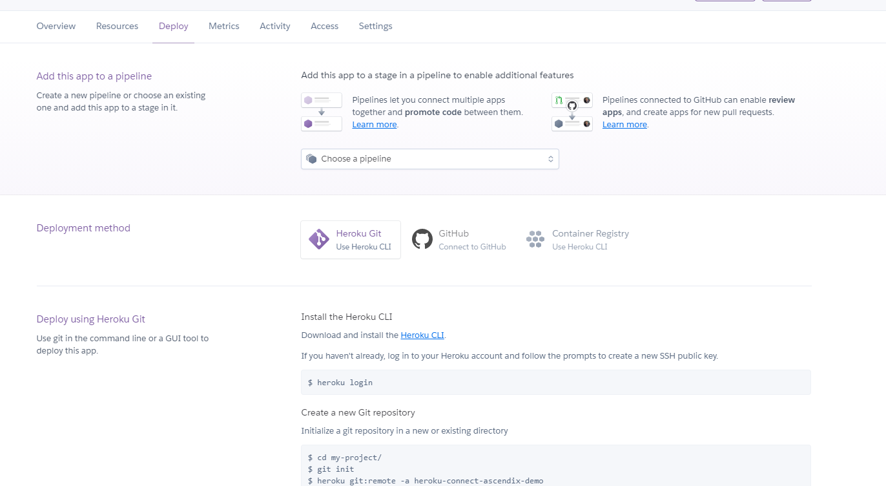

# It is an example of your first Heroku APP

You can find the Heroku connect example and other examples to connect with Salesforce.

## Prepare you environment
- [Install Heroku CLI](https://devcenter.heroku.com/articles/heroku-cli)
- [Sign up fo Free](https://signup.heroku.com/trailhead)
- Create the App on the Heroku dashboard
- Follow steps from the **Deploy** section

  
## Set up your Environment variables from the CLI 
- Connect your Heroku Account to CLI
```
heroku login
```
- Update Environment variables via CLI (-a your app alias)
```
heroku config:set MESSAGE="My new message" -a heroku-connect-ascendix-demo
```
- How to see Log in real time
```
heroku logs --tail -a heroku-connect-ascendix-demo
```
## [Configure Heroku Connect](https://devcenter.heroku.com/articles/heroku-connect#setting-up-heroku-connect)
- Update the `.env` file to connect this APP for your Postgres DB
